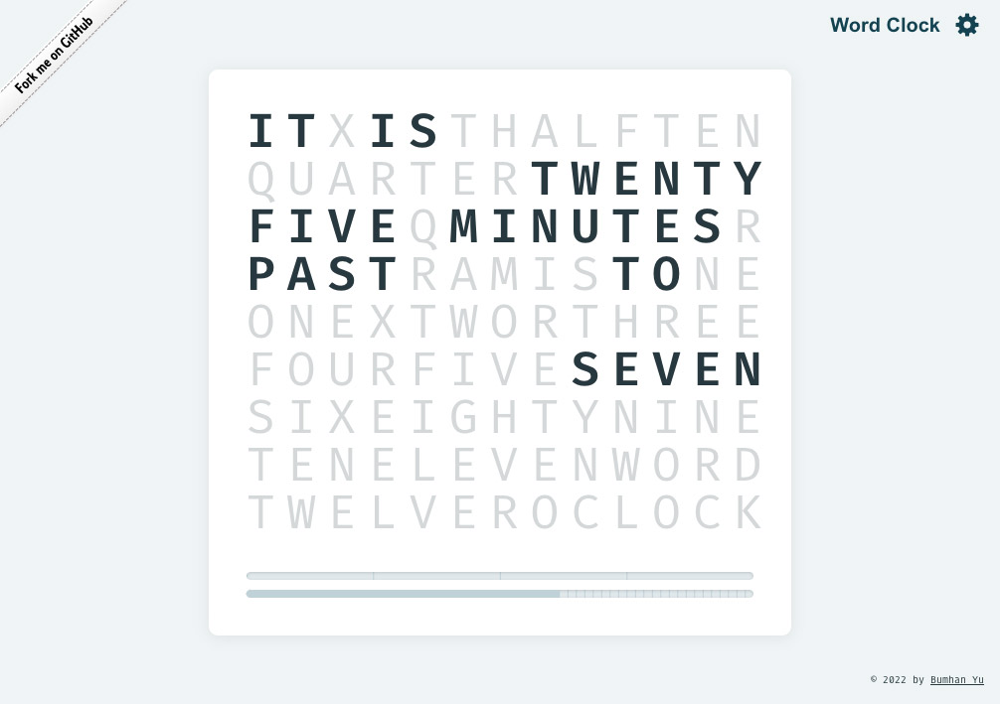
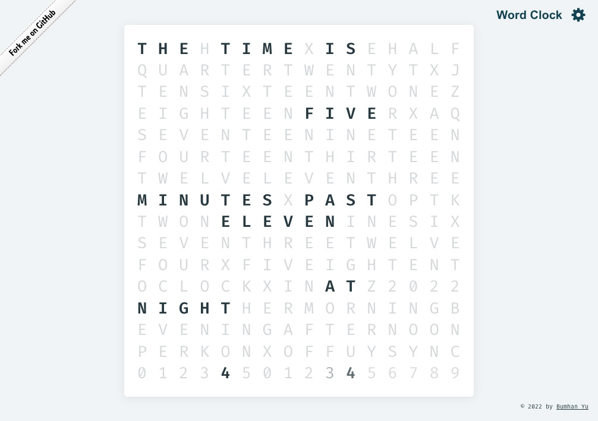
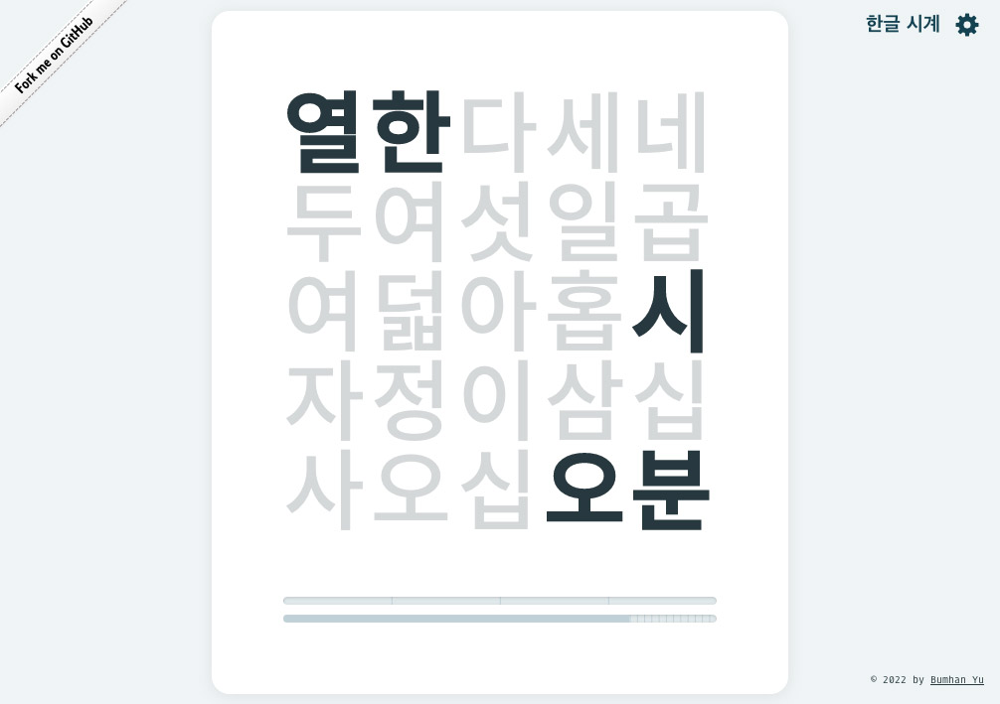
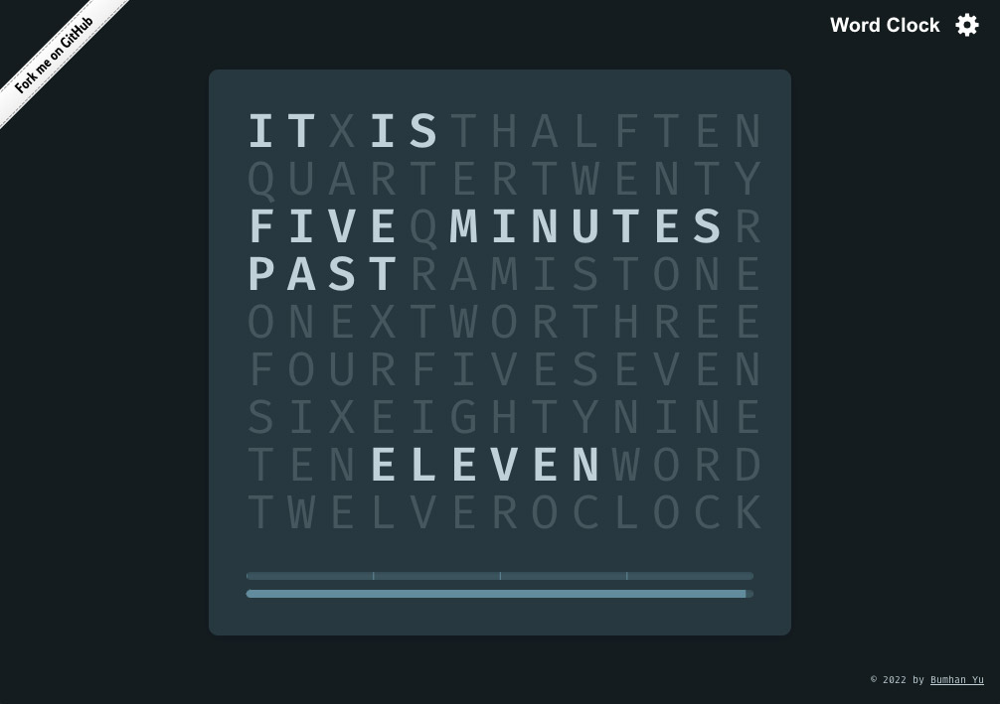
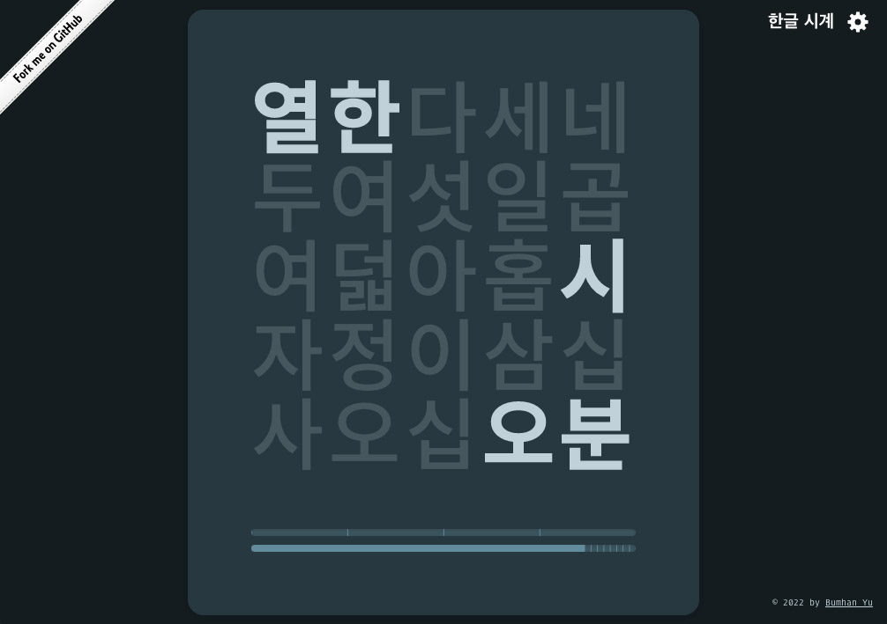

# Word Clock

### What it is

A bilingual work clock that displays the current time in written sentences.

- Built with [Create React App](https://github.com/facebook/create-react-app) in TypeScript flavor, [Styled-components](https://www.styled-components.com/), and [CSS Custom Properties](https://developer.mozilla.org/en-US/docs/Web/CSS/--*)
- Tells time in two languages (English and Korean) in text
- Supports light and dark modes
- Toy mode is included for playing around

### Snapshots

Word Clock in simple English mode in light color theme

Word Clock in sophisticated English mode in light color theme

Word Clock in Korean mode in light color theme

Word Clock in simple English mode in dark color theme

Word Clock in sophisticated English mode in dark color theme

Word Clock in Korean mode in dark color theme

### TODOs

- [ ] State persistence via `localStorage`
- [ ] Introduce more themes (e.g. colorways, typefaces, etc)
- [ ] Clean up code and beef up visual styles

### Inspirations

- [An Instructables article](https://www.instructables.com/A-Word-Clock/)
- [An Arduino word clock](http://www.brettoliver.org.uk/Word_Clock/Word_Clock.htm?i=1)
- [A Korean word clock](https://www.wadiz.kr/web/campaign/detail/1240)
